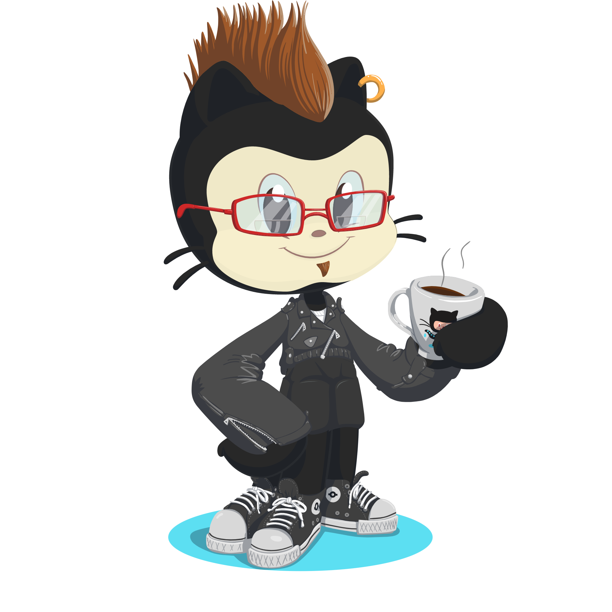

    

#

Front-end Developer - Seeking knowledge and opportunities

* 🌍  I'm based in Paraíba, Brazil
* ✉️  You can contact me at [wlymes@gmail.com](mailto:wlymes@gmail.com)
* 🚀  I'm currently working on [Personal Projects - Open to Work](http://portfolio-renovatt.vercel.app/)
* 🧠  I'm learning Node.js, Express and Prisma
* 🤝  I'm open to collaborating on interesting projects
* ⚡  God give rock 'n' roll to you

#

  

<h2 align="center"><b>Skills</b></h2>

    
    
    
    
    
    
    
    
    
    
     
    
    
    
    

<h2 align="center"><b>Socials</b></h2>

 
     
     
    
    

<h2 align="center"><b>Badges</b></h2>

<b>My GitHub Stats</b>

 <a href="https://github.com/renovatt">
  

  

<!--  -->

<!--  
<h2 align="center"><b>Top Repositories</b></h2>
 

    
    

    
       

 -->

<!--       -->
<!--       -->

   
  
<b>Você faz parte dos</b>
  
  

    
     
    
<b>visitantes.</b>
 
  
 

 
 
